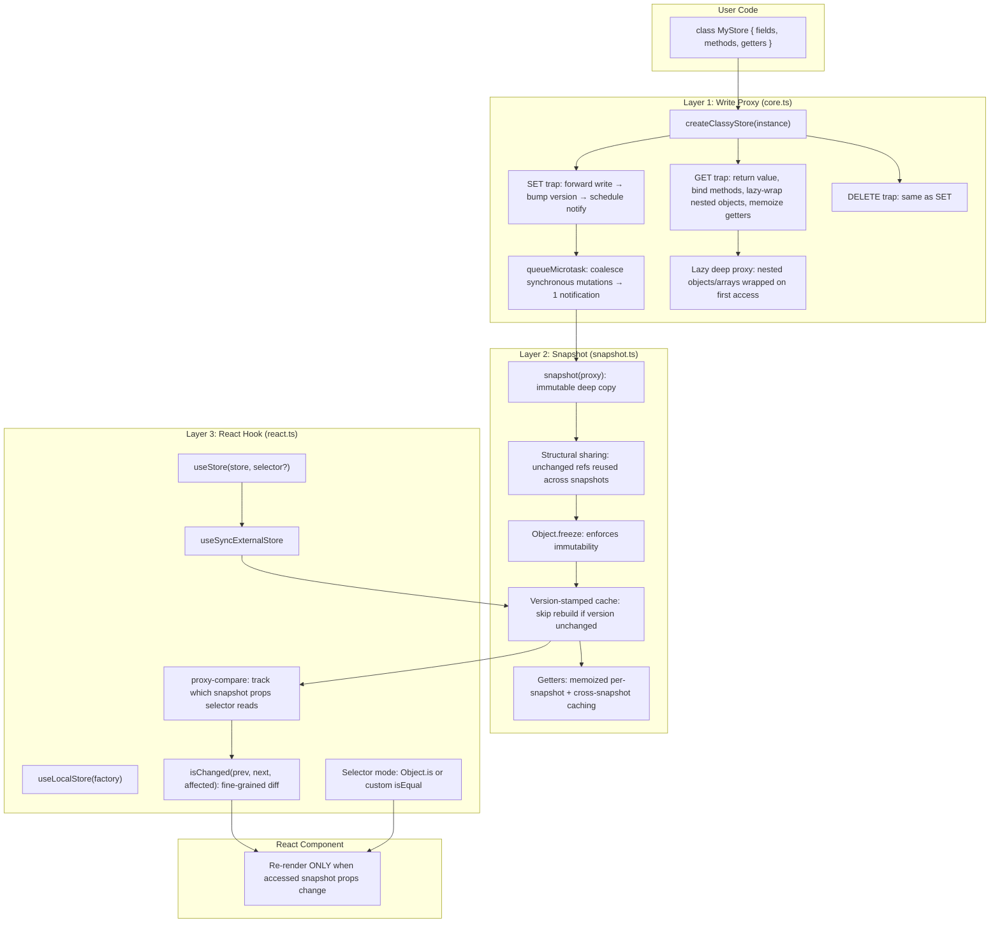
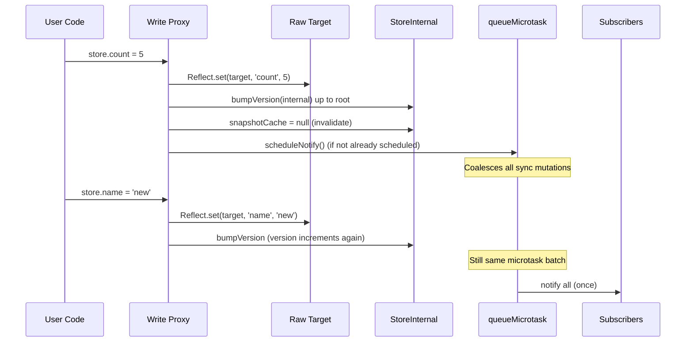
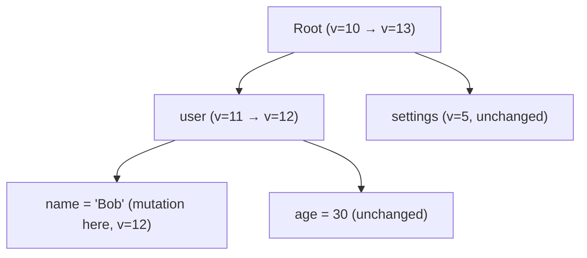
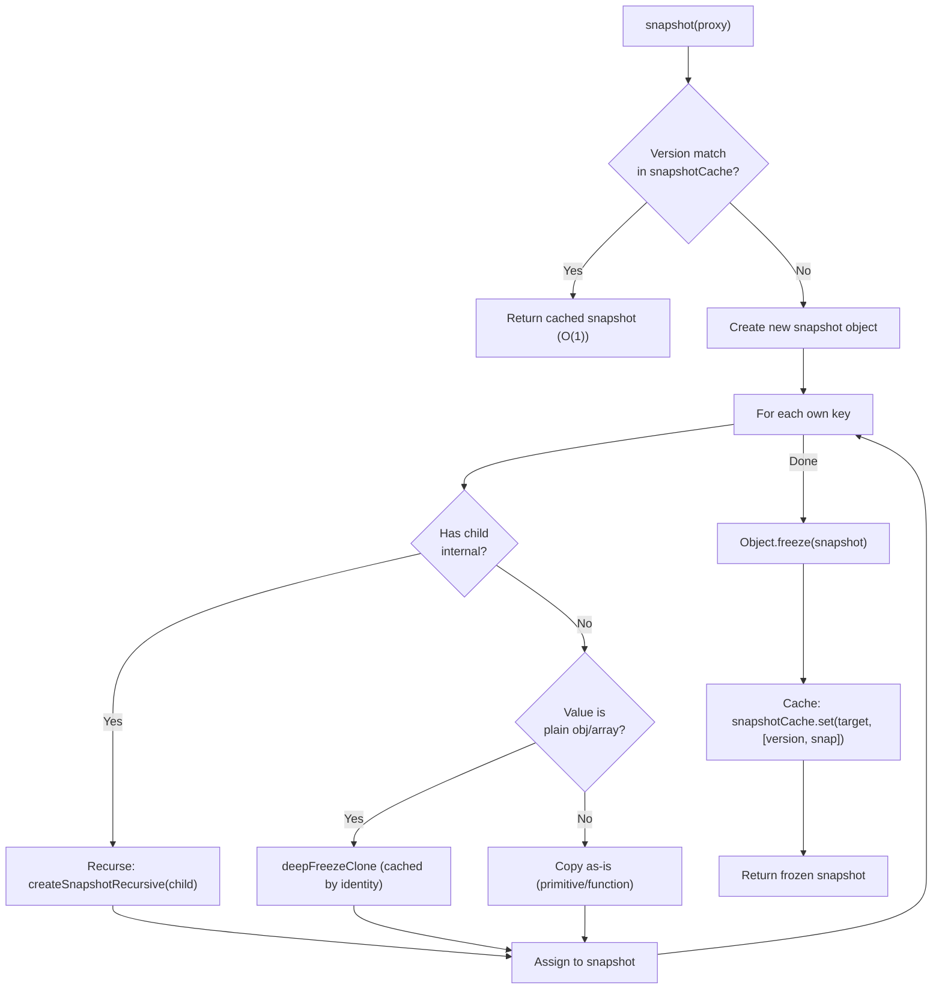
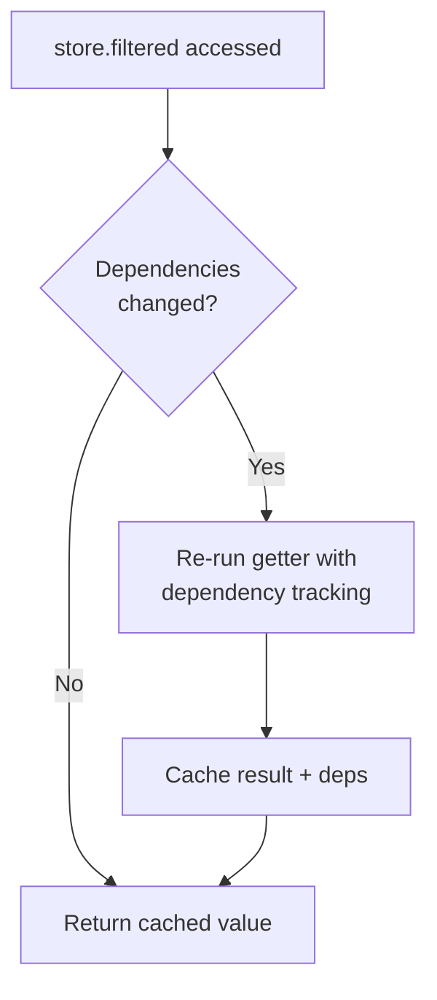
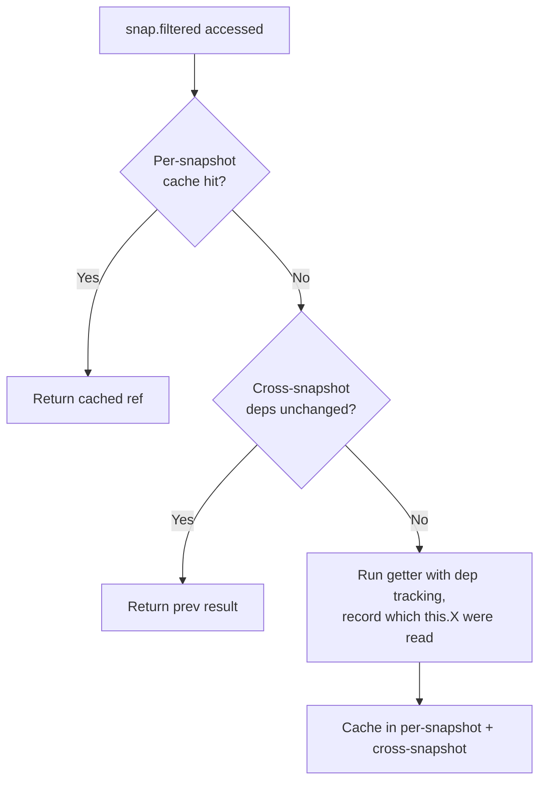
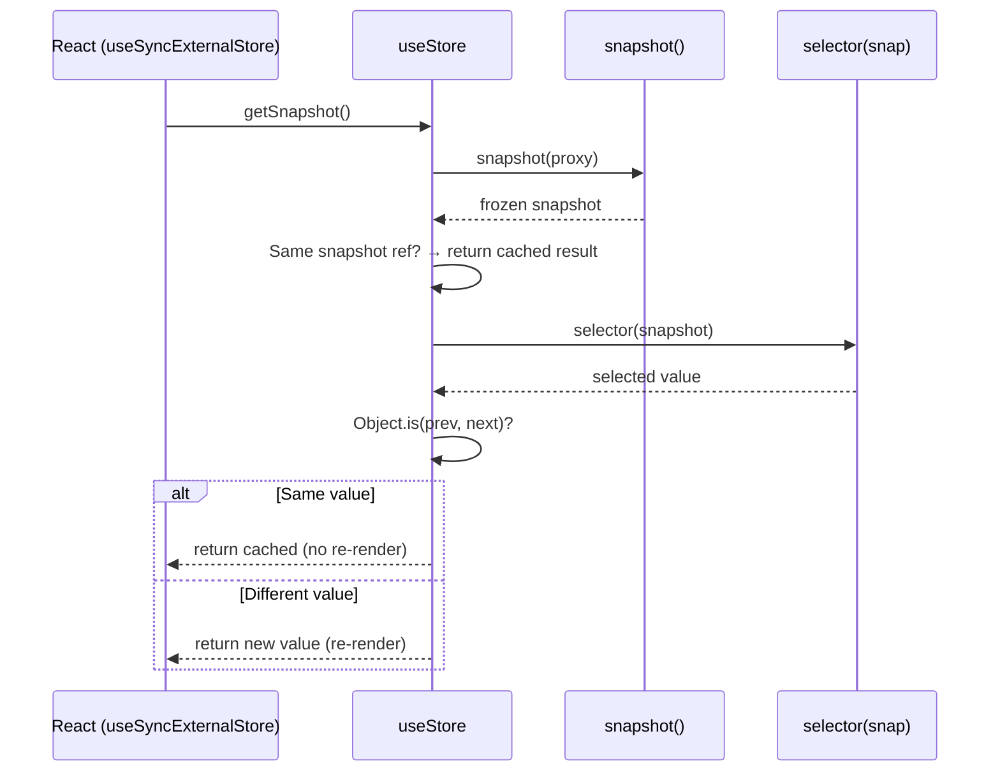
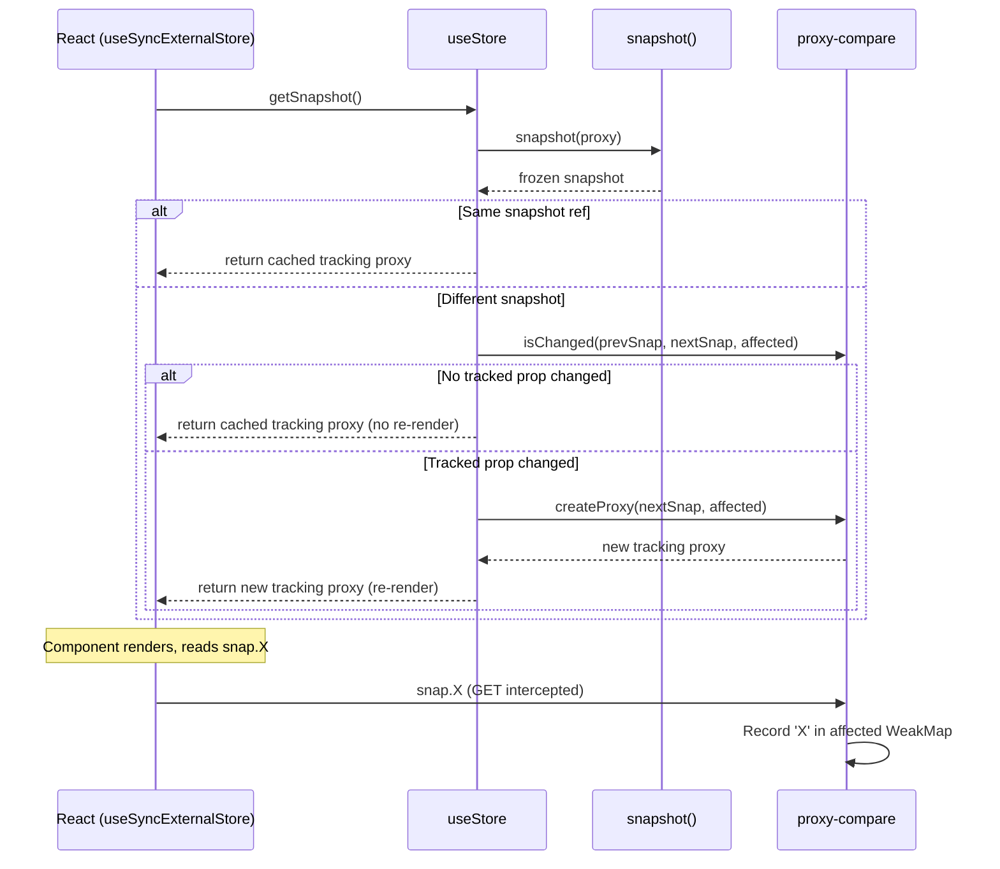
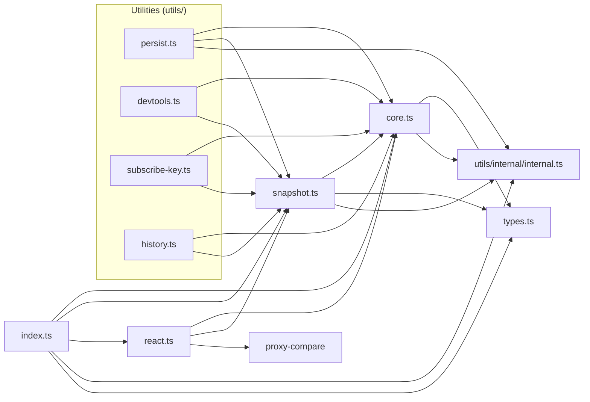

# Classy Store — Architecture

Internal design documentation for contributors and maintainers.

## Three-Layer Architecture

The library is organized into three distinct layers, each with a single responsibility:



## File Map

```
src/
├── index.ts                       # Barrel export: createClassyStore, useStore, snapshot, subscribe, getVersion, shallowEqual, Snapshot, reactiveMap, reactiveSet, ReactiveMap, ReactiveSet
├── collections/
│   ├── collections.ts             # ReactiveMap and ReactiveSet implementations
│   └── collections.test.ts        # tests: ReactiveMap, ReactiveSet, class store integration
├── core/
│   ├── core.ts                    # Layer 1: Write Proxy — createClassyStore(), subscribe(), getVersion()
│   ├── core.test.ts               # tests: mutations, batching, methods, getters, arrays
│   └── computed.test.tsx           # tests: write proxy + snapshot memoization, useStore integration
├── react/
│   ├── react.ts                   # Layer 3: React Hook — useStore(), useLocalStore()
│   ├── react.test.tsx             # tests: selector mode, auto-tracked mode, re-render control
│   └── react.behavior.test.tsx    # tests: batching, set-then-revert, async, multi-component, unmount
├── snapshot/
│   ├── snapshot.ts                # Layer 2: Immutable Snapshots — snapshot()
│   └── snapshot.test.ts           # tests: freezing, caching, structural sharing, getters
├── utils/
│   ├── index.ts                   # Barrel export for @codebelt/classy-store/utils: persist, devtools, subscribeKey, withHistory
│   ├── devtools/
│   │   ├── devtools.ts            # devtools() utility: Redux DevTools integration, time-travel debugging
│   │   └── devtools.test.ts       # tests: connect, disconnect, state sync, time-travel
│   ├── equality/
│   │   ├── equality.ts            # shallowEqual
│   │   └── equality.test.ts       # tests for shallowEqual
│   ├── history/
│   │   ├── history.ts             # withHistory() utility: undo/redo via snapshot stack, pause/resume, configurable limits
│   │   └── history.test.ts        # tests: undo, redo, limits, pause/resume
│   ├── internal/
│   │   ├── internal.ts            # Internal helpers: isPlainObject, canProxy, findGetterDescriptor, PROXYABLE
│   │   └── internal.test.ts       # tests for internal helpers
│   ├── persist/
│   │   ├── persist.ts             # persist() utility: storage, transforms, versioning, cross-tab sync
│   │   └── persist.test.ts        # tests: round-trip, transforms, debounce, migration, merge, SSR, cross-tab
│   ├── subscribe-key/
│   │   ├── subscribe-key.ts       # subscribeKey() utility: single-property subscription with prev/current values
│   │   └── subscribe-key.test.ts  # tests: single key changes, prev/current values
├── types.ts                       # Shared types: Snapshot<T>, StoreInternal, DepEntry, ComputedEntry
package.json
tsconfig.json
tsdown.config.ts
bunfig.toml                        # Preload happy-dom for React hook tests
happydom.ts                        # happy-dom global registrator
README.md                          # Usage guide
ARCHITECTURE.md                    # This file
TUTORIAL.md                        # Step-by-step tutorial
PERSIST_TUTORIAL.md                # Persist utility tutorial
PERSIST_ARCHITECTURE.md            # Persist utility internals
```

## Layer 1: Write Proxy (`core.ts`)

### Overview

The `createClassyStore()` function wraps a class instance in an ES6 Proxy. All mutations — property writes, array operations, nested object changes — are intercepted and batched into a single notification per microtask.

### Data Flow: Mutation → Notification



### Internal State Storage

All internal bookkeeping is stored in a `WeakMap<proxy, StoreInternal>`:

```typescript
type StoreInternal = {
  target: object;                           // Raw class instance
  version: number;                          // Monotonically increasing
  listeners: Set<() => void>;               // Subscriber callbacks
  childProxies: Map<string|symbol, object>; // Cached child proxies
  childInternals: Map<string|symbol, StoreInternal>;
  parent: StoreInternal | null;             // For version propagation
  notifyScheduled: boolean;                 // Batch dedup flag
  snapshotCache: [number, object] | null;       // Version-stamped snapshot cache
  computedCache: Map<string|symbol, ComputedEntry>; // Memoized getter cache
};
```

### Proxy Traps

**SET trap:**
1. Compare old and new values with `Object.is` — noop if equal
2. Clean up child proxy if the property is being replaced
3. Forward write to raw target via `Reflect.set`
4. Bump version for this node and all ancestors
5. Schedule notification via `queueMicrotask` (deduped)

**GET trap (priority order):**
1. **Memoized getter detection** — walk prototype chain with `Object.getOwnPropertyDescriptor`. If a getter is found, call `evaluateComputed()` which checks dependency validity and returns the cached result or re-evaluates with dependency tracking.
2. **Method binding** — if value is a function, bind to proxy so `this.count++` in methods goes through the SET trap. Bound methods are cached.
3. **Nested objects/arrays** — if value passes `canProxy()` (plain object or array), lazily wrap in a child proxy. Child proxies are cached in `childProxies` Map. Also records a dependency if a getter is currently being tracked.
4. **Primitives** — return as-is. Also records a dependency if a getter is currently being tracked.

**DELETE trap:** Same pattern as SET — clean up child proxy, delete from target, bump version, schedule notify.

### Batching via `queueMicrotask`

Array operations like `push()` trigger multiple SET traps (element + length). Rather than notifying per-trap, a dirty flag + `queueMicrotask` coalesces all synchronous mutations into one notification:

```
store.items.push('a')
  → SET trap for index 0 → scheduleNotify (flags, queues microtask)
  → SET trap for length  → scheduleNotify (already flagged, skips)
  → microtask fires → notifies listeners ONCE
```

### Version Propagation

When a nested property mutates, versions bump from the mutated node up to the root:



This enables structural sharing: when the snapshot layer sees that `settings` has the same version, it returns the cached snapshot reference.

## Layer 2: Immutable Snapshots (`snapshot.ts`)

### Overview

`snapshot(proxy)` creates a deeply frozen, plain-JS copy of the store state. Unchanged sub-trees reuse previous snapshot references (structural sharing).

### Snapshot Creation Flow



### Two Cache Strategies

1. **Tracked sub-trees** (`snapshotCache` — `WeakMap<rawTarget, [version, frozenSnap]>`):
   Objects that have been accessed through the proxy have a `StoreInternal` with version tracking. The snapshot recurses into them and uses version-stamped caching for structural sharing.

2. **Untracked sub-trees** (`untrackedCache` — `WeakMap<rawObject, frozenClone>`):
   Objects never accessed through the proxy are deep-cloned and frozen. The clone is cached by the raw object's identity. Since untracked objects can't be mutated through the proxy, the cache is always fresh.

### Structural Sharing Example

```
Snapshot v1:                    Snapshot v2 (after user.name = 'Bob'):
┌──────────┐                    ┌──────────┐
│ root     │                    │ root     │ (new object)
│ user ────┼──→ {name:'Alice'}  │ user ────┼──→ {name:'Bob'} (new)
│ settings─┼──→ {theme:'dark'}  │ settings─┼──→ {theme:'dark'} (SAME ref ===)
└──────────┘                    └──────────┘
```

`snap2.settings === snap1.settings` because the `settings` sub-tree's version didn't change → cache hit → same reference.

### Getter Evaluation (Memoized)

Snapshots preserve the prototype chain and install lazy-memoizing getters on each snapshot object. Getter results are cached at two levels:

1. **Per-snapshot cache** — repeated access to the same getter on the same snapshot returns the identical reference.
2. **Cross-snapshot cache** — if the properties the getter reads are structurally the same across snapshots (via reference equality from structural sharing), the previous result is returned.

```typescript
class Store {
  count = 5;
  get doubled() { return this.count * 2; }
}

const snap = snapshot(createClassyStore(new Store()));
snap.doubled; // 10 — computed once, cached
snap.doubled; // 10 — same reference (per-snapshot cache hit)
```

## Computed Getter Memoization

Class getters are automatically memoized at two layers — the write proxy and the snapshot — without any user-facing API changes. This is analogous to MobX's `@computed`, but implemented transparently via Proxy.

### Write Proxy Memoization (`core.ts`)

When a getter is accessed on the write proxy, `evaluateComputed()` runs the getter with dependency tracking. A module-level tracker stack records which properties the getter reads on `this`:



**Dependency types:**
- **Sub-tree dep** (`kind: 'version'`): the getter read a nested object/array. Validated by comparing `internal.version` — O(1) per dep.
- **Primitive dep** (`kind: 'value'`): the getter read a primitive. Validated by `Object.is(target[prop], recordedValue)` — O(1) per dep.

**Nested getter support:** when getter A reads getter B, B pushes its own frame onto the tracker stack. If B returns cached, A's deps include B's deps (propagated). If B recomputes, the underlying reads naturally propagate to A's tracker.

### Snapshot Memoization (`snapshot.ts`)

Since snapshots are frozen, a getter's result can never change for a given snapshot. But more importantly, getter results are stable **across** snapshots when dependencies haven't changed:



**Cross-snapshot mechanism:**
1. First evaluation: a lightweight tracking Proxy records which `this` properties the getter reads and their values.
2. On subsequent snapshots: for each recorded property, check `Object.is(currentSnap[prop], previousValue)`.
3. Structural sharing guarantees that unchanged sub-trees have the same reference — so if `this.todos` hasn't changed, the reference comparison passes and the cached result is returned.
4. For getters reading other getters (e.g., `get filteredCount() { return this.filtered.length; }`): the inner getter is itself memoized, so it returns a stable reference, which the outer getter's dep check recognizes as unchanged.

**Impact on `useStore`:** The existing hook benefits automatically — no changes needed:
- **Selector mode:** `useStore(store, (store) => store.filtered)` gets a stable reference from the memoized snapshot getter. `Object.is` correctly detects "no change" without `shallowEqual`.
- **Auto-tracked mode:** `proxy-compare`'s `isChanged` gets stable references from snapshot getters, reducing false positives.

## Layer 3: React Hook (`react.ts`)

### Overview

`useStore` uses `useSyncExternalStore` for tear-free React integration. It supports two modes:

### Mode 1: Selector

```typescript
const count = useStore(myStore, (store) => store.count);
```



**Equality chain:**
1. Same snapshot reference? → skip selector entirely (O(1))
2. Run selector → compare result with `Object.is` (or custom `isEqual`)
3. Same result → return previous reference (no re-render)

### Mode 2: Auto-tracked (selectorless)

```typescript
const snap = useStore(myStore);
// snap.count — tracked
// snap.user.name — tracked
```



**How `proxy-compare` works:**
- `createProxy(snapshot, affected)` wraps the frozen snapshot in a Proxy that records which properties are read into the `affected` WeakMap
- `isChanged(prevSnap, nextSnap, affected)` checks if any tracked property differs between two snapshots
- Only structural changes to accessed properties cause re-renders

## Dependency Graph



## Key Design Decisions

### Why ES6 Proxy instead of `Object.defineProperty`?

ES6 Proxy supports intercepting property creation, deletion, and arbitrary key access — not just known properties. This is essential for arrays (index access) and dynamic objects. All modern browsers and Node.js/Bun support Proxy natively.

### Why `queueMicrotask` for batching?

`queueMicrotask` runs after the current synchronous code but before the next paint/timer. This means:
- Multiple mutations in the same event handler → 1 notification
- Array `push` (which triggers multiple SET traps) → 1 notification
- No risk of missing updates (unlike `requestAnimationFrame`)

### Why structural sharing in snapshots?

Without structural sharing, `Object.is(prevSelector, nextSelector)` would always return `false` for object/array selectors because each snapshot creates new objects. Structural sharing ensures unchanged sub-trees maintain reference equality, making selectors efficient without custom equality functions.

### Why `proxy-compare` for auto-tracking?

`proxy-compare` (~1KB, maintained by the creator of Valtio/Zustand/Jotai) provides battle-tested property access tracking. It wraps a frozen object in a Proxy that records reads, then efficiently diffs only the accessed properties between snapshots. This eliminates the need for manual selectors in many cases.

### Why `useSyncExternalStore` instead of `useState` + `useEffect`?

`useSyncExternalStore` is React's official API for external stores. It:
- Prevents tearing (concurrent mode safe)
- Integrates with React's scheduler
- Works with server-side rendering (via `getServerSnapshot`)
- Is the same API used by Zustand, Redux, and Valtio

### Why `WeakMap` for internal state?

Storing internals in a `WeakMap<proxy, StoreInternal>` instead of on the proxy itself:
- Doesn't pollute the user's object with library metadata
- Allows garbage collection when the store is no longer referenced
- Prevents conflicts with user-defined properties

### Why subclass inheritance works

No special handling is needed — three mechanisms in the existing design make it work automatically:

1. **Methods** — The GET trap uses `Reflect.get(target, prop)`, which naturally walks the JavaScript prototype chain. Methods from any ancestor class are found and bound to the proxy via `.bind(receiver)`, so `this` mutations inside inherited methods go through the SET trap.

2. **Getters** — `findGetterDescriptor()` (in `utils.ts`) walks the prototype chain with `Object.getOwnPropertyDescriptor` and returns the first (most-derived) getter found. For snapshots, `collectGetters()` (in `snapshot.ts`) walks the full chain using a `seen` Set to ensure overridden getters are collected only once — the most-derived version wins.

3. **Snapshot prototype** — `createSnapshotRecursive()` creates snapshot objects with `Object.create(Object.getPrototypeOf(target))`, preserving the full prototype chain. This means `snapshot(store) instanceof DerivedClass` is `true`, and `installMemoizedGetters()` installs getters from all levels with cross-snapshot memoization.

`super.method()` calls also work because they use the language-level prototype dispatch mechanism, which resolves to the parent method with `this` still bound to the proxy.

## Performance Characteristics

| Operation | Complexity | Notes |
|-----------|-----------|-------|
| Property read | O(1) | Direct Proxy GET trap |
| Property write | O(depth) | Versions bump from node to root |
| Notification | O(listeners) | Once per microtask batch |
| Getter (cache hit) | O(deps) | Check deps validity, return cached |
| Getter (cache miss) | O(getter body) | Re-evaluates with dep tracking |
| Snapshot (cache hit) | O(1) | Version check only |
| Snapshot (cache miss) | O(changed branches) | Structural sharing skips unchanged |
| Snapshot getter (same snap) | O(1) | Per-snapshot cache hit |
| Snapshot getter (cross-snap) | O(deps) | Reference comparison via structural sharing |
| Selector equality | O(1) for primitives | `Object.is` check |
| Auto-track diff | O(accessed props) | `proxy-compare` checks only read props |
