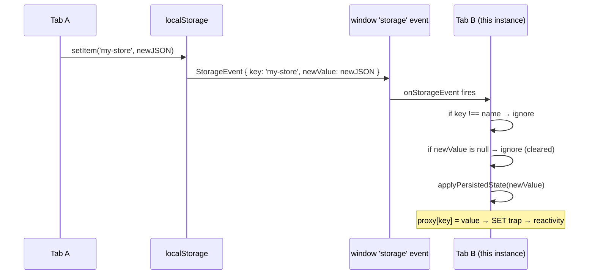
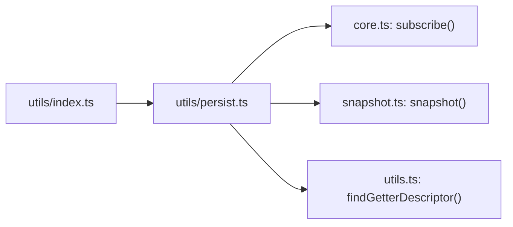

# Persist Utility -- Architecture

Internal design documentation for the `persist()` utility in `@codebelt/classy-store/utils`.

## Design Principles

1. **Standalone utility, not middleware.** `persist` is a plain function that consumes two existing public APIs (`subscribe` and `snapshot`) and nothing else. No changes to `core.ts`, `snapshot.ts`, or `useStore.ts` were needed.

2. **Tree-shakeable.** `persist` lives in a separate entry point (`@codebelt/classy-store/utils`). Applications that don't use persistence pay zero cost -- the code is never bundled.

3. **Storage-agnostic.** The `StorageAdapter` interface accepts sync (`localStorage`, `sessionStorage`) and async (`AsyncStorage`, `localForage`) implementations through the same type. `persist` handles both transparently via `await`.

4. **Class-aware.** The utility understands class stores: getters and methods are automatically excluded from persistence. Only source-of-truth data properties are saved. This is a key differentiator from libraries like Zustand where `partialize` requires manual exclusion.

## How It Hooks Into the Existing Architecture

`persist` sits beside the existing three-layer architecture as an independent consumer:

```mermaid
flowchart LR
  subgraph existingCore ["Existing Core (unchanged)"]
    Mutation["store.prop = x"] --> Batch["queueMicrotask notify"]
    Batch --> Listeners["subscribe callbacks"]
  end

  subgraph persistLayer ["persist() utility"]
    Listeners --> Debounce["debounce timer"]
    Debounce --> Snap["snapshot(proxy)"]
    Snap --> Pick["pick properties"]
    Pick --> Serialize["per-property serialize"]
    Serialize --> Envelope["JSON.stringify envelope"]
    Envelope --> Storage["storage.setItem()"]
  end

  subgraph hydration ["Hydration (init / cross-tab / manual)"]
    Read["storage.getItem()"] --> Parse["JSON.parse"]
    Parse --> Migrate["version check + migrate"]
    Migrate --> Deserialize["per-property deserialize"]
    Deserialize --> Merge["merge strategy"]
    Merge --> Apply["proxy[key] = value"]
    Apply --> Mutation
  end
```



The key insight: writing `proxy[key] = value` during hydration flows through the existing SET trap in `core.ts`, which handles child proxy cleanup, version bumping, and notification scheduling automatically. The persist utility doesn't need to know anything about the proxy internals.

## File Structure

```
packages/store/
  src/
    index.ts                    # Existing barrel (unchanged)
    utils/
      index.ts                  # Barrel: export { persist } from './persist/persist'
      persist/
        persist.ts              # persist(), types, and all logic
        persist.test.ts         # 38 tests with mock storage adapters
  package.json                  # "./utils" export entry
  tsdown.config.ts              # 'src/utils/index.ts' in entry array
```

## Internal State

Each `persist()` call creates a closure with the following internal state:

| Variable | Type | Purpose |
|---|---|---|
| `disposed` | `boolean` | Guards against writes after `unsubscribe()` |
| `debounceTimer` | `ReturnType<typeof setTimeout> \| null` | Active debounce timer (cancelled on save/unsubscribe) |
| `hydratedFlag` | `boolean` | Synchronous hydration status |
| `resolveHydrated` | `() => void` | Resolves the `hydrated` promise |
| `rejectHydrated` | `(error) => void` | Rejects the `hydrated` promise on error |
| `resolvedProps` | `Array<{key, transform?}>` | Normalized property list with optional transforms |
| `transformMap` | `Map<string, PropertyTransform>` | Fast lookup from key to transform |
| `propKeys` | `string[]` | Flat list of property keys to persist |

No global mutable state. Multiple `persist()` calls on different stores (or even the same store with different keys) are fully independent.

## Save Flow

Triggered by `subscribe(proxy, callback)` firing after each batched mutation:

```
1. subscribe callback fires
2. if disposed → return (guard)
3. if debounce > 0:
     cancel existing timer
     schedule new timer → goto step 4 after delay
   else:
     goto step 4 immediately
4. snapshot(proxy) → frozen immutable copy
5. for each key in propKeys:
     read value from snapshot
     if transform exists → call transform.serialize(value)
     assign to state object
6. wrap in envelope: { version, state }
7. JSON.stringify(envelope)
8. await storage.setItem(name, json)
```

### Property Resolution

On initialization, `resolveProperties()` determines which keys to persist:

- **If `properties` is provided:** each entry is either a string key (used as-is) or a `PropertyTransform` descriptor (key extracted, transform stored in `transformMap`).
- **If `properties` is omitted:** takes a snapshot of the store, iterates `Object.keys()`, and excludes:
  - **Getters:** detected via `findGetterDescriptor()` walking the prototype chain with `Object.getOwnPropertyDescriptor`.
  - **Methods:** detected via `typeof value === 'function'` on the proxy.

This resolution happens once at `persist()` call time, not on every save.

### Storage Envelope

Data is stored as a JSON string with a version wrapper:

```json
{
  "version": 1,
  "state": {
    "todos": [{"text": "Buy milk", "done": false}],
    "filter": "all"
  }
}
```

The `version` field is always present (default `0`). The `state` field contains only the selected properties, post-serialization-transform.

## Restore Flow (Hydration)

Triggered in three scenarios:
1. **Auto-hydration on init** (unless `skipHydration: true`)
2. **Manual rehydrate** via `handle.rehydrate()`
3. **Cross-tab sync** via `window.storage` event

All three call the same `applyPersistedState(raw)` function:

```
1. JSON.parse(raw) → envelope
2. Validate envelope shape (object with .state)
   if invalid → return silently (corrupted data)
3. if envelope.version !== options.version AND migrate exists:
     state = migrate(state, envelope.version)
4. for each key in state:
     if transform exists → state[key] = transform.deserialize(state[key])
5. Build currentState from snapshot (only propKeys)
6. Apply merge strategy:
     'shallow' / 'replace': { ...currentState, ...persistedState }
     custom function: merge(persistedState, currentState)
7. for each key in propKeys:
     if key in mergedState → proxy[key] = mergedState[key]
     (goes through SET trap → reactivity → batched notification)
8. Set hydratedFlag = true, resolve hydrated promise
```

### Merge Strategies

| Strategy | Behavior |
|---|---|
| `'shallow'` (default) | `{ ...current, ...persisted }` -- persisted keys overwrite, new keys keep defaults |
| `'replace'` | Same as shallow at top level. Conceptually signals full replacement for nested objects. |
| Custom `fn` | `fn(persisted, current)` -- full control. Enables deep merge or selective overrides. |

Both `'shallow'` and `'replace'` produce the same result for flat stores. The distinction is semantic and affects how consumers think about nested object handling.

### Error Handling

- **Corrupted JSON** in storage (`JSON.parse` throws): caught silently, hydration completes with no state changes.
- **Invalid envelope** (missing `.state` or not an object): detected by shape check, skipped silently.
- **Async errors** during `storage.getItem()`: caught, hydrated promise rejects, `hydratedFlag` still set to `true`.

## Cross-Tab Sync

When `syncTabs` is enabled (default for `localStorage`), the utility listens for the `window.storage` event:



Key properties of `window.storage`:
- Fires in **other** same-origin tabs only (not the tab that wrote). This prevents infinite loops.
- Only works with `localStorage` -- not `sessionStorage`, not async adapters.
- The event payload includes `key`, `oldValue`, `newValue`, and `storageArea`.

### Auto-detection

If `syncTabs` is not explicitly set:
- `true` when the storage adapter is literally `globalThis.localStorage` (checked via identity comparison).
- `false` for everything else (`sessionStorage`, `AsyncStorage`, custom adapters).

## Cleanup

`handle.unsubscribe()` performs three cleanup steps:

```
1. Set disposed = true (guards all future writes)
2. Cancel pending debounce timer (if any)
3. Call unsubscribe from store mutations (remove subscribe callback)
4. Remove window 'storage' event listener (if syncTabs was active)
```

After `unsubscribe()`:
- Store mutations no longer trigger writes to storage.
- Cross-tab changes to the storage key are ignored.
- `save()` becomes a no-op.
- `clear()` and `rehydrate()` still work (they operate on storage directly, not on subscriptions).

## PersistHandle API

| Method/Property | Behavior |
|---|---|
| `unsubscribe()` | Full cleanup: unsubscribe + cancel debounce + remove storage listener. Idempotent. |
| `hydrated` | Promise that resolves when initial hydration completes. Rejects on async storage errors. |
| `isHydrated` | Getter returning `boolean`. Becomes `true` after hydration resolves or rejects. |
| `save()` | Cancel pending debounce, write current state immediately. No-op if disposed. |
| `clear()` | Call `storage.removeItem(name)`. Works even after unsubscribe. |
| `rehydrate()` | Re-read from storage, apply to store. Also resolves `hydrated` if not yet resolved (for `skipHydration` flows). |

## Dependency Graph



`persist` has **no dependency** on `useStore.ts`, `types.ts`, or `collections.ts`. It only uses:
- `subscribe()` -- to listen for store mutations
- `snapshot()` -- to create an immutable copy for serialization
- `findGetterDescriptor()` -- to detect class getters during property resolution

## Performance Characteristics

| Operation | Complexity | Notes |
|---|---|---|
| Property resolution | O(keys) | Once at init, not per-save |
| Save (per mutation batch) | O(propKeys) | Snapshot + pick + serialize + JSON.stringify |
| Debounced save | O(1) per mutation | Timer reset; actual save is O(propKeys) when timer fires |
| Hydration | O(propKeys) | JSON.parse + deserialize + merge + assign |
| Cross-tab sync | O(propKeys) | Same as hydration, triggered by storage event |
| `save()` | O(propKeys) | Same as auto-save, synchronous trigger |
| `unsubscribe()` | O(1) | Flag + timer cancel + listener removal |

## Design Decisions

### Why a function, not a decorator or middleware?

Decorators require class modifications and don't compose well with the existing `store()` wrapping. Middleware requires an interception layer that doesn't exist in the architecture (the proxy IS the middleware). A standalone function that takes a proxy and returns a handle is the simplest, most composable API.

### Why per-property transforms instead of global serialize/deserialize?

Global `serialize`/`deserialize` (as in Zustand's `createJSONStorage`) operates on the entire state blob. This makes it awkward when only one property needs special handling (e.g., a single `Date` field among ten string fields). Per-property transforms are more ergonomic for class-based stores where each property has a known type.

### Why exclude getters automatically?

Class getters are derived/computed values that recompute from persisted data properties. Persisting a getter result would be redundant and risk restoring a stale value that contradicts the actual data. For example, if `get remaining()` returns 3 but the persisted `todos` array has 5 incomplete items, the restored getter value would be wrong until something triggers a recompute. By excluding getters, we persist only the inputs and let the outputs recompute naturally.

### Why a hydrated Promise instead of lifecycle hooks?

Zustand uses `onRehydrateStorage` (a callback), Pinia uses `beforeHydrate`/`afterHydrate` hooks. A Promise is more composable: it works with `async`/`await`, can be passed to React Suspense boundaries, and doesn't require a registration pattern. The `isHydrated` boolean covers the synchronous check case.

### Why debounce instead of throttle?

Debounce waits for a quiet period after the last mutation. Throttle writes at regular intervals. For persistence, debounce is more appropriate: it coalesces bursts of mutations (like typing) into a single write, while throttle would write mid-burst with potentially incomplete state. `save()` provides the escape hatch for "write right now" scenarios.

## Test Coverage

38 tests across 9 test groups:

| Group | Tests | What's covered |
|---|---|---|
| Basic round-trip | 5 | Save/restore, versioned envelope, getter exclusion, method exclusion |
| Properties option | 2 | Persist specific properties, restore only specified properties |
| Per-property transforms | 2 | Date round-trip, ReactiveMap round-trip |
| Debounce | 2 | Coalescing, save bypass |
| Version migration | 2 | Migration call, version match skip |
| Merge strategies | 3 | Shallow, replace, custom function |
| skipHydration | 3 | No auto-hydrate, manual rehydrate, promise resolution |
| Unsubscribe | 2 | Stop writes, cancel debounce |
| Flush/clear/rehydrate | 4 | Immediate write, remove data, in-memory preservation, re-read |
| Hydration state | 2 | Promise instance, resolution timing |
| Async storage | 2 | Async write, async hydrate |
| Cross-tab sync | 4 | Correct key, wrong key, post-unsubscribe, disabled |
| Edge cases | 4 | Empty storage, corrupted JSON, invalid envelope, no-storage error, multiple persists |
